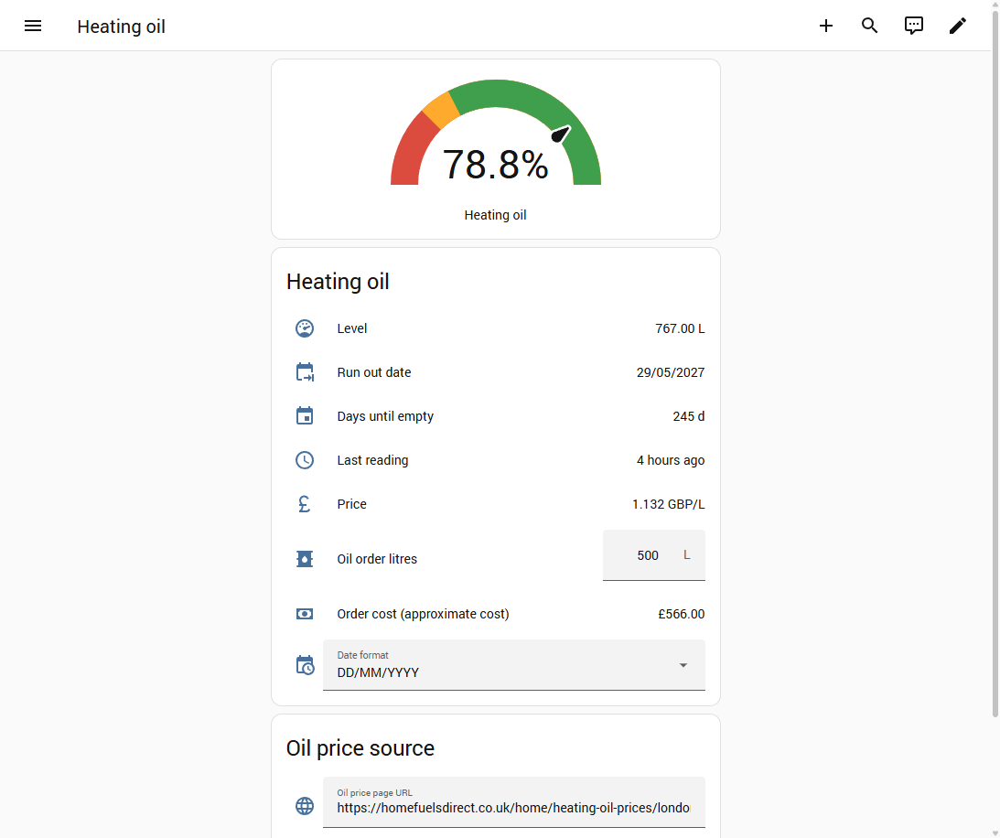

# Kingspan heating oil gauge

Watchman SENSiT tank level on a Home Assistant **Heating oil** dashboard, plus a scrapable £/L price and an order-cost calculator.

This repo is YAML helpers, a REST scrape, and a Lovelace card snippet. Tank readings come from the existing [Kingspan Watchman SENSiT](https://github.com/masaccio/ha-kingspan-watchman-sensit) integration. Username and password are entered in **Settings → Devices & services**. Do **not** put Kingspan passwords in YAML or `secrets.yaml`.

Presence simulator lives in a separate repo: [presence_simulator](https://github.com/guido100uk/presence_simulator). The older combined tree is archived at [home_assistant](https://github.com/guido100uk/home_assistant).

## Install

1. If **HACS** is already on the house: HACS → search **Watchman SENSiT** → Download → restart Core if asked.
2. If HACS is not installed: copy a published release of `custom_components/kingspan_watchman_sensit` onto `/config/custom_components/` through the sidebar **Terminal** add-on, then `ha core restart`. Do not use Samba/SSH from this PC.
3. Settings → Devices & services → **Add integration** → **Kingspan Watchman SENSiT**.
4. Type the same username and password as the Kingspan / Connect Sensor app. Leave **name** as `My Tank` unless you want a different device name.

After setup, Developer tools → States should show sensors prefixed with the tank/device name. With the default name **My Tank**:

- `sensor.my_tank_tank_percentage_full`
- `sensor.my_tank_oil_level`
- `sensor.my_tank_forecast_empty`
- `sensor.heating_oil_run_out_date` (last reading plus forecast empty days)
- `sensor.my_tank_last_reading_date`

Search for `tank_percentage_full` if the ids differ.

5. Create `/config/packages` if it does not exist. Copy `packages/heating_oil.yaml` into `/config/packages/`. The live house must already have `homeassistant.packages: !include_dir_named packages` in `configuration.yaml`. Do **not** replace that file.
6. Developer tools → YAML → **Check configuration**, then restart Home Assistant.
7. Add the cards from `dashboards/oil_tank.yaml` to a UI-storage **Heating oil** dashboard (this house uses sidebar path `/heating-oil/oil`). Do **not** set `lovelace.mode: yaml` on a house that already uses the UI Overview.

## Gauge on Overview (Home)

The live house Overview is the built-in **Home** dashboard (UI storage). Home does not accept a raw Lovelace gauge card; pin the tank sensors as **Favorites** instead (**Edit overview** → **Add favorite**).

The needle gauge plus litres, **Run out date**, days, last reading, and current £ per litre lives on the sidebar **Heating oil** dashboard. **Run out date** (`sensor.heating_oil_run_out_date`) is the tank **Last reading** timestamp plus the SENSiT forecast-empty days, not the Home Assistant clock. If the tank sensors are missing it stays unavailable instead of showing today. **Date format** defaults to **DD/MM/YYYY** and keeps the last choice across restarts. **System default** uses the Home Assistant locale date; the other options are **MM/DD/YYYY**, **YYYY-MM-DD**, and **D Month YYYY**. Severity is red below 25%, yellow 25–35%, green at 35% and above. Tank values only change when Kingspan has a new cloud reading (the integration polls about every 8 hours).

## Current oil price

The **Heating oil** page shows **Price** and an **Oil price source** menu:

- **Oil price page URL** — default `https://homefuelsdirect.co.uk/home/heating-oil-prices/london`. Change this if you want a different county or another public price page.
- **Oil price CSS selector** — default `#currentLivePrice` (Home Fuels Direct’s live average). For another site, use a simple `#id` or `.class` / `tag.class` that wraps the number.
- **Oil price is pence** — on means the scraped number is pence per litre and is stored as GBP/L (`÷ 100`). Turn it off if the page already shows pounds.

The sensor is `sensor.heating_oil_price_per_litre`. It polls about once a day and also refreshes when you change the URL, selector, or pence toggle. If the selector does not match, it falls back to the first `NN.NN pence` on the page. Do not put passwords in the URL helper.

**Oil order litres** is a number you type on the Heating oil page (default 500 L, range 1–5000). **Order cost (approximate cost)** is that amount times the current price, in GBP, rounded to 2 decimals (`sensor.heating_oil_order_cost`). It updates as soon as you change the litres or a new price is scraped.

## Deploy a package update to the live house

The running Home Assistant is at `http://your ip address running HA/` (port 80). Copy through the sidebar **Terminal** add-on.

1. Backup: `cp /config/packages/heating_oil.yaml /config/packages/heating_oil.yaml.bak`
2. Copy this repo’s `packages/heating_oil.yaml` to `/config/packages/heating_oil.yaml`
3. `ha core check`
4. `ha core restart`
5. Commit and push the same change to GitHub

This GitHub repo is private, so `raw.githubusercontent.com` will 404 without auth. Copy files from a clone, not from a raw URL.

## Files

| File | Purpose |
| --- | --- |
| `packages/heating_oil.yaml` | Price URL/selector helpers, litres box, REST price, order-cost template |
| `dashboards/oil_tank.yaml` | Card snippet for the live Heating oil dashboard |
| `docs/heating-oil.png` | Screenshot of the Heating oil dashboard |
| `tests/test_heating_oil_package.py` | Package and README checks |
